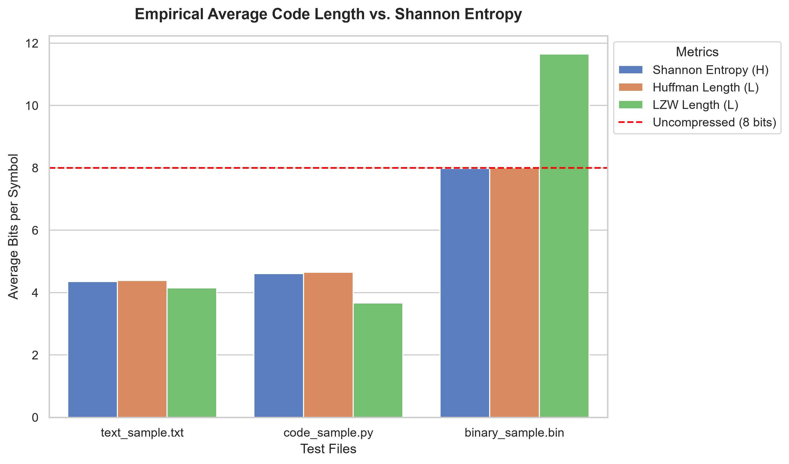
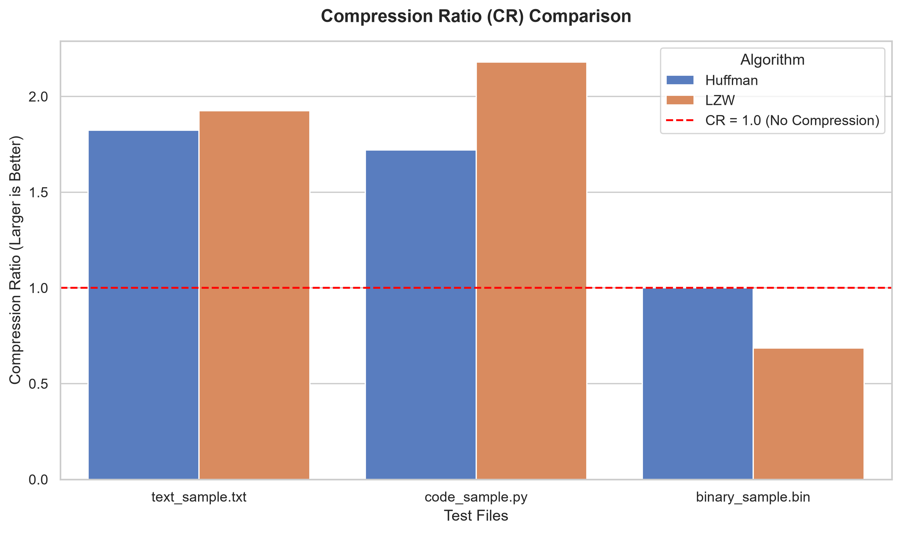

# Empirical Evaluation of Lossless Data Compression

## Overview
This repository contains a comprehensive Python-based implementation and empirical analysis of two fundamental lossless data compression algorithms: **Huffman Coding** and **Lempel-Ziv-Welch (LZW)**.

## Project Structure
- `src/`: Core implementation of compression algorithms.
- `data/`: Datasets used for benchmarking (Natural Text, Source Code, Binary).
- `figures/`: Visual analysis and performance charts.
- `results/`: Processed benchmark metrics.

## Performance Analysis
The project evaluates the Average Code Length (L) and Compression Ratio (CR) against the theoretical Shannon Entropy lower bound.

### 1. Average Code Length Comparison

### 2. Compression Ratio (CR)

## Key Findings
- **Huffman Coding:** Highly efficient for memoryless statistical sources.
- **LZW:** Superior performance on structured data (Source Code) due to dictionary-based pattern matching.
- **Incompressibility:** Random binary data confirms the limitations of lossless compression on maximum-entropy sources.

## License
Distributed under the MIT License. See `LICENSE` for more information.